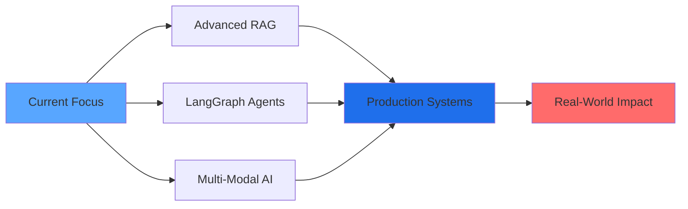

<div align="center">
  
</div>

<div align="center">
  
[](https://git.io/typing-svg)

</div>

<div align="center">
  
[](https://linkedin.com/in/biresh-kumar-singh-84a127281)
[](mailto:bireshkumar1964@gmail.com)
[](https://github.com/biresh1929)


</div>

---

## 🚀 About Me

```python
class AIEngineer:
    def __init__(self):
        self.name = "Biresh Kumar Singh"
        self.education = "B.Tech CSE @ Bharati Vidyapeeth (CGPA: 9.06/10)"
        self.role = "AI/ML Engineer & Full-Stack Developer"
        self.location = "Pune, Maharashtra, India"
        self.current_focus = ["RAG Systems", "LLM Applications", "Agentic AI"]
        self.achievements = {
            "JPMorgan Code for Good": "Top 450 / 50,000+ applicants",
            "PAN IIT Imagine Cup": "Top 20 Finalist / 15,000+ registrations"
        }
        self.looking_for = "AI/ML opportunities in RAG and LLM development"
        
    def say_hi(self):
        print("Thanks for dropping by! Let's build something amazing together!")

me = AIEngineer()
me.say_hi()
```

<div align="left">

**Education:** B.Tech CSE (Expected 2027) | **CGPA:** 9.06/10

**Passionate about:** Building production-ready AI systems with real-world impact

**Currently working on:** AI Multimodal SAAS

**Learning:** Advanced RAG architectures, LangChain, Agentic AI, Vector Databases

**Experience:** SDE Intern @ Timechain Source Of Code (Jul-Sep 2024)

**Open to:** AI/ML opportunities, especially in RAG, LLMs, and NLP

</div>

---

## 🏆 Featured Projects

<table>
<tr>
<td width="50%">

### 🤖 End-to-End Hiring Assistant Chatbot
**Production-grade AI recruiter with RAG & security**

[](http://16.171.5.156:8501/)
[](https://github.com/biresh1929/hiring-assistant-rag-chatbot)

**Tech Stack:**
- 🦜 LangChain & RAG
- 🔐 AWS Secrets Manager
- 🐳 Docker + ECR
- ⚙️ GitHub Actions CI/CD

**Key Features:**
- Context-aware technical interviews
- Fernet encryption for data security
- GDPR-compliant (view/export/delete)
- AWS EC2 production deployment

</td>
<td width="50%">

### 📄 End-to-End PDF Question Generator
**AI-powered Q&A generation with semantic search**

[](http://13.51.169.254:8080/)
[](https://github.com/biresh1929/PDF-Interview-Questions-Generator)

**Tech Stack:**
- ⚡ FastAPI Backend
- 🔍 Pinecone Vector DB
- 🤖 LLaMA 7B Model
- 📊 Sentence-Transformers

**Key Features:**
- Semantic retrieval with embeddings
- Structured Q&A generation
- CSV export functionality
- Complete CI/CD pipeline

</td>
</tr>
<tr>
<td width="50%">

### 🎨 AI Agent Image Generator
**Autonomous multi-step reasoning agent**

[](https://huggingface.co/spaces/birubhai/ai-agent-image-generator)
[](https://github.com/biresh1929/AI-agent-Image-Generator)

**Tech Stack:**
- 🤗 SmolAgents Framework
- 🧠 Qwen 2.5 Coder (7B)
- 🔎 DuckDuckGo Search
- 🎭 HuggingFace Models

**Key Features:**
- Thought-Action-Observation loop
- Streaming agent reasoning
- Real-time web search
- Interactive Gradio UI

</td>
<td width="50%">

### 🏠 Property Registry (Blockchain)
**Svelte-based blockchain property management**

[](https://property-registry.vercel.app/)

**Tech Stack:**
- ⛓️ Blockchain Architecture
- 💼 Smart Contracts
- 🎨 Svelte Frontend
- 🔐 SPV Wallets

**Key Features:**
- Decentralized registry
- Secure property transactions
- Scalable architecture
- Final qualifying project

</td>
</tr>
</table>

---

## 🌟 Open Source Contributions

<div align="center">

### 🛒 **Gumroad** - E-commerce Platform

[](https://github.com/antiwork/gumroad/pull/490)
[](https://github.com/antiwork/gumroad/pull/447)

**Contributions:** Feature enhancements · Bug fixes · Code optimization · Documentation

*Impacting thousands of creators on the Gumroad platform*

</div>

---

## 💻 Technical Arsenal

<div align="center">

### 🧠 AI/ML & Deep Learning


### 🎯 Core Expertise


### 🌐 Web & Backend Development


### 🗄️ Databases & Cloud


### ⚙️ Tools & DevOps


### 📊 Data Science & Visualization


</div>

---

## 🏅 Achievements & Recognition

<div align="center">

<table>
<tr>
<td align="center" width="50%">

### 🏆 JPMorgan Chase & Co.
**Code for Good 2025**


**Top 450 out of 50,000+ applicants**

Shortlisted after rigorous coding rounds and technical interviews

[](https://drive.google.com/file/d/1kfgoIL4kKyl_qsCAv3OxySh_WIhOUhAF/view)

</td>
<td align="center" width="50%">

### 🥈 PAN IIT Imagine Cup
**Imagine Hackathon 2025**


**Top 20 Finalist among 72 teams**

Selected from 15,000+ registrations

[](https://drive.google.com/file/d/1LT9eH27-Yd-3qsLdxGd6U8hnueTbmBey/view)

</td>
</tr>
</table>

</div>

---

## 📊 GitHub Analytics

<div align="center">
  
  
</div>

<div align="center">
  
</div>

<div align="center">
  
</div>

---

## 🎯 What I Bring to the Table

<div align="center">

| **Experience** | **Research & Innovation** | **Academic Excellence** |
|:---:|:---:|:---:|
| Production AI deployments | Advanced RAG architectures | 9.06/10 CGPA |
| AWS cloud infrastructure | Agentic AI systems | Strong CS fundamentals |
| Full CI/CD pipelines | LLM fine-tuning | DSA, DBMS, OS, Networks |
| Open-source contributions | Vector search optimization | Continuous learner |

</div>

---

## 💼 Professional Experience

<div align="center">

### 💻 Software Development Intern
**Timechain Source Of Code** | *Jul 2024 – Sep 2024*

</div>

- Explored SPV wallets, smart contracts, and scalable blockchain architectures
- Led development of Property Registry application using Svelte
- Earned Skilled Developer Certificate as final qualifying project
- Delivered production-ready blockchain solution with security best practices

---

## 🎯 Current Focus & Learning Path

<div align="center">



</div>

<div align="center">

| **Research Areas** | **Building** | **Mastering** |
|:---:|:---:|:---:|
| Advanced RAG Techniques | Production AI Systems | LangGraph & Agentic AI |
| Prompt Engineering | AWS Cloud Architecture | Multi-Modal Models |
| LLM Fine-tuning | Scalable Infrastructure | Vector Databases |
| AI Security & Privacy | CI/CD for ML | AI Safety & Ethics |

</div>

---

## 💼 Open to Opportunities

<div align="center">

### **Actively Seeking AI/ML Roles**


I'm passionate about building intelligent systems and am actively looking for opportunities in:

**AI/ML Engineering** - RAG systems, LLM applications, NLP

**Research & Development** - Cutting-edge AI solutions

**Innovation Projects** - Agentic AI, Multi-modal systems

**Full-time/Internship** - Ready to contribute from day one

</div>

<div align="center">

**What I Offer:**

Production-grade AI system development

Strong foundation in ML/DL frameworks (TensorFlow, PyTorch, Keras)

Expertise in RAG, LLMs, and prompt engineering

End-to-end deployment experience (AWS, Docker, CI/CD)

Proven problem-solving skills (Top hackathon finalist)

Open-source contribution mindset

**Specialized in:** Retrieval-Augmented Generation (RAG) · Large Language Models · NLP · Deep Learning · Prompt Engineering · Production ML Systems

📧 **Let's Connect:** [bireshkumar1964@gmail.com](mailto:bireshkumar1964@gmail.com)

💼 **LinkedIn:** [Biresh Kumar Singh](https://linkedin.com/in/biresh-kumar-singh-84a127281)

</div>

---

## 🤝 Let's Collaborate

<div align="center">

I'm always excited to collaborate on innovative AI projects! Whether you're working on:

RAG applications & LLM systems · Production ML deployments · Open-source AI tools · Research in NLP & deep learning · Hackathons & competitions

**Feel free to reach out! Let's build something amazing together** 🚀

</div>

---

## 📈 GitHub Contribution Activity

<div align="center">
  
</div>

---

<div align="center">
  
### 💭 Random Dev Quote
  


</div>

---

<div align="center">
  
**⭐️ From [biresh1929](https://github.com/biresh1929) | Building the future with AI, one commit at a time**

*Fun Fact: I love turning complex AI research into production-ready applications!*


</div>
